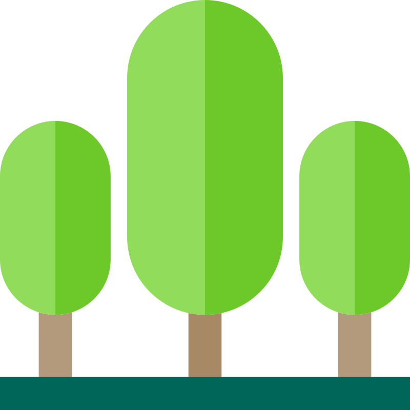

<p align="center">
    
</p>


<p align="center">
    
    
    
</p>

<p align="center">
    
    
    
    
    

</p>

**Susie** is a <a href="https://philippedeb.github.io/susie/">website</a> aimed at Sustainable Software Development and consists of:

* **Analysis Tool 🔍** - Check the sustainability of a GitHub repository
* **Guides 📰** - Learn more about sustainable software development


## Installation

You should have [Node.js](https://nodejs.org/en/), [npm](https://www.npmjs.com/) and [git](https://git-scm.com/) installed on your machine.

1. Clone the repository to your local machine.
    ```bash
    git clone https://github.com/philippedeb/susie.git
    ```


2. Navigate to the project directory.
    ```bash
    cd your-repository
    ```

3. Install the dependencies.
    ```bash
    npm install
    ```

4. Run the project.
    ```bash
    npm run dev
    ```

## Contributing

Contributions are always welcome! 👋 

Read the [contribution guidelines](CONTRIBUTING.md) and [code of conduct](CODE_OF_CONDUCT.md). 

## License
This project is licensed under the terms of the **[GNU AGPLv3](https://choosealicense.com/licenses/agpl-3.0/)** license.
